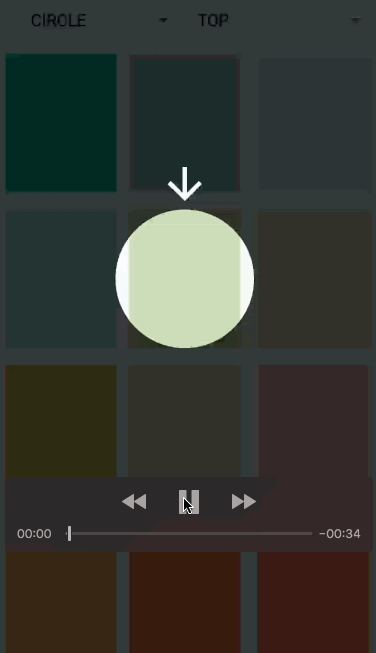

# FreeCover

feel free to create a highlight layer that cover over the target view.

### demo



### Useage

Step 1. Add jitpack in your root `build.gradle` :

```
	allprojects {
		repositories {
			...
			maven { url 'https://jitpack.io' }
		}
	}
```

Step 2. Add the dependency

```
	dependencies {
	    compile 'com.github.deskid:freecover:1.0.0'
	}
```

Step 3. Happy coding


```
FreeCover.ImageCoverBuilder imageCoverBuilder = new FreeCover.ImageCoverBuilder()
                .setAnchor(anchor)
                .setTopOffset(0)
                .setBottomOffset(0)
                .setLeftOffset(0)
                .setRightOffset(0)
                .setWidth(100)
                .setHeight(100)
                .setImgRes(R.drawable.ic_arrow_downward_black_24dp);

FreeCover.init(this, mRecyclerView.getChildAt(position))
        .setHoleStyle(style)
        .setImageCover(imageCoverBuilder)
        .setupView();

```
